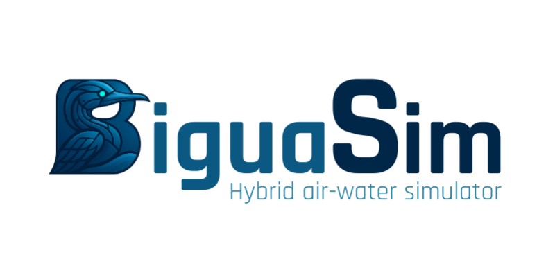

# BiguaSim



<!-- [](https://biguasim.readthedocs.io/en/latest/?badge=latest)
 [](https://robots.et.byu.edu:4000/frostlab/biguasim) -->


BiguaSim is a high-fidelity simulator for underwater robotics built on top of Unreal Engine 5, and forked from Holodeck by BYU's PCCL Lab.

If you use BiguaSim for your research, please cite our ICAR publication;

```
@inproceedings{mateus2025biguasim,
  title={BiguaSim: A Hybrid Multi-Domain Simulator for Robotics High-Fidelity Simulation and Synthetic Dataset Generation},
  author={Mateus, Matheus G and De Oliveira, Guilherme C and Reichow, Luis Henrique K and Kolling, Alisson H and Pinheiro, Pedro M and Drews-Jr, Paulo LJ},
  booktitle={2025 IEEE International Conference on Advanced Robotics (ICAR)},
  pages={169--174},
  year={2025},
  organization={IEEE}
}
```

## Features
 - The vehicles were redesigned with the addition of commercial vehicles.
 - All the vehicle dynamics originally implemented in the Engine, in a fairly simple way, were transformed into a pseudo-engine in Python considering mathematical models (FossenDynamics and RotorPy), through pytorch to calculate the behavior of the vehicles extremely quickly and then communicate the feedback of the state presented in UE5 with the calculated inputs.
 - New generations of ground-through data have been created, such as element detection, dynamic semantic segmentation for customized environments, depth maps with real distance values, and representations of sonar data such as point clouds, elevation maps, and intensity maps.
 - 3 rich worlds with various infrastructure for generating data or testing aerial, surface and underwater algorithms
 - Complete with common underwater sensors including DVL, IMU, optical camera, various sonar, depth sensor, and more
 - Highly and easily configurable sensors and missions
 - Multi-agent missions, including optical and acoustic communications
 - Novel sonar simulation framework for simulating imaging, profiling, sidescan, and echosounder sonars
 - Imaging sonar implementation includes realistic noise modeling for small sim-2-real gap
 - Easy installation and simple, OpenAI Gym-like Python interface
 - High performance - simulation speeds of up to 2x real time are possible. Performance penalty only for what you need
 - Run headless or watch your agents learn
 - Linux and Windows support

## Installation
`git clone https://github.com/hydrone-furg/biguasim.git`

(requires >= Python 3.10)

#### Conda Environment
```
cd biguasim

conda env create -f environment.yml

pip install .

```

#### Local / Different Virtual Environment
```
cd biguasim

pip install .

```

<!-- See [Installation](https://biguasim.readthedocs.io/en/latest/usage/installation.html) for complete instructions. -->

- Docker usage:
`docker run -it \
  --name biguasim \
  --privileged \
  --ipc=host \
  --gpus all \
  --runtime=nvidia \
  -v /tmp/.X11-unix:/tmp/.X11-unix \
  -v $HOME/path/to/biguasim/content:/home/biguasim/workspace \
  -e DISPLAY=$DISPLAY \
  -e NVIDIA_VISIBLE_DEVICES=all \
  -e NVIDIA_DRIVER_CAPABILITIES=compute,graphics,utility \
  -e QT_X11_NO_MITSHM=1 \
  mgmateus/hydrone:biguasim-base`

  To use your local worlds add to docker command: 
  
  `-v $HOME/path/to/your/worlds:/home/biguasim/.local/share/biguasim/1.0.0/worlds \`
  
  `su biguasim`
  - password sudo : `biguasim`
    
  `cd workspace/biguasim`
  
  `sudo pip install .`

## Documentation
### Comming soon.
<!-- * [Quickstart](https://biguasim.readthedocs.io/en/latest/usage/getting-started.html)
* [Changelog](https://biguasim.readthedocs.io/en/latest/changelog/changelog.html)
* [Examples](https://biguasim.readthedocs.io/en/latest/usage/getting-started.html#code-examples)
* [Agents](https://biguasim.readthedocs.io/en/latest/agents/agents.html)
* [Sensors](https://biguasim.readthedocs.io/en/latest/biguasim/sensors.html)
* [Available Packages and Worlds](https://biguasim.readthedocs.io/en/latest/packages/packages.html)
* [Docs](https://biguasim.readthedocs.io/en/latest/) -->

## Usage Overview
BiguaSim's interface is similar to [OpenAI's Gym](https://gym.openai.com/). 

We try and provide a batteries included approach to let you jump right into using BiguaSim, with minimal
fiddling required.

To demonstrate, here is a quick example using the `DefaultWorlds` package:

```python
import biguasim

biguasim.install('SkyDive')

```

```python
import biguasim

cfg = {
    "package_name": "SkyDive",               
    "world": "Relief-Generic-Bridge-Vehicles-Water-Custom",                            
    "main_agent": "uav0",                               
    "ticks_per_sec": 20,
    "frames_per_sec": True,
    "octree_min": 0.02,
    "octree_max": 5.0,                              
    "agents":[                                          
        {                                               
            "agent_name": "uav0",                       
            "agent_type": "DjiMatrice",                
            "sensors": [
                    {
                        "sensor_type": "DynamicsSensor",
                        "socket": "IMUSocket",
                        "configuration": {
                            "UseCOM": True,
                            "UseRPY": False  
                        }
                    }           
            ],
            "dynamics" : {
                "batch_size" : 1,
            },  
            "control_abstraction": 'cmd_motor_speeds',
            "location": [0, 0, 40],
            "rotation": [0, 0, -90],    
        }
    ]
}

# Load the environment. 
with biguasim.make(scenario_cfg=cfg) as env:

  # You must call `.reset()` on a newly created environment before ticking/stepping it
  env.reset()                         

  # The UAV takes commands for each thruster
  command = [300, 300, 300, 300]   
  for i in range(30):
      state = env.step(command)  
```

- `state`: dict of sensor name to the sensor's value (nparray).

If you want to access the data of a specific sensor, import sensors and
retrieving the correct value from the state dictionary:

##### State format: state[agent_name][batch_position][sensor]

```python
print(state['uav0'][0]["RangeFinderSensor"])
```

## Multi Agent-Environments
BiguaSim supports multi-agent environments.

```python
import biguasim

cfg = {
    "package_name": "SkyDive",               
    "world": "Relief-Generic-Bridge-Vehicles-Water-Custom",                            
    "main_agent": "uav0",                               
    "ticks_per_sec": 20,
    "frames_per_sec": True,
    "octree_min": 0.02,
    "octree_max": 5.0,                              
    "agents":[                                          
        {                                               
            "agent_name": "uav0",                       
            "agent_type": "DjiMatrice",                
            "sensors": [
                    {
                        "sensor_type": "DynamicsSensor",
                        "socket": "IMUSocket",
                        "configuration": {
                            "UseCOM": True,
                            "UseRPY": False  
                        }
                    }           
            ],
            "dynamics" : {
                "batch_size" : 1,
            },  
            "control_abstraction": 'cmd_motor_speeds',
            "location": [0, 0, 40],
            "rotation": [0, 0, -90],    
        },
        {                                               
            "agent_name": "auv0",                       
            "agent_type": "TorpedoAUV",                
            "sensors": [
                    {
                        "sensor_type": "DynamicsSensor",
                        "socket": "IMUSocket",
                        "configuration": {
                            "UseCOM": True,
                            "UseRPY": False  
                        }
                    }           
            ],
            "dynamics" : {
                "batch_size" : 1,
            },  
            "control_abstraction": 'cmd_depth_heading_rpm_surge',
            "location": [0, 0, -3],
            "rotation": [0, 0, -90],    
        }
    ]
}

with biguasim.make(scenario_cfg=cfg) as env:
  env.reset()

  command = {
    'uav0' : [300, 300, 300, 300],
    'auv0' : [5, 45, 1000, 1]
  }  

  for i in range(30):
      state = env.step(command)  
```

You can access the sensor states as before:

```python
dvl = states["auv0"][0]["DVLSensor"]
location = states["uav0"][0]["DepthSensor"]
```
<!-- 

## Running BiguaSim Headless
BiguaSim can run headless with GPU accelerated rendering. See [Using BiguaSim Headless](https://biguasim.readthedocs.io/en/latest/usage/running-headless.html) -->

