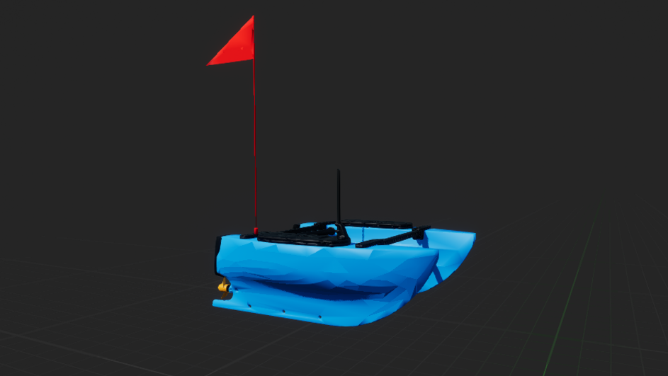
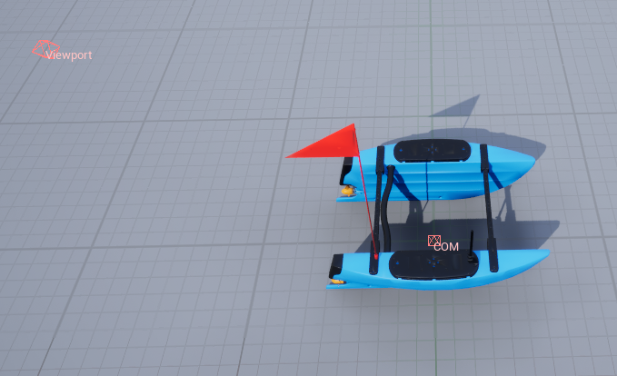

.. _`blue-boat-agent`:

========
BlueBoat
========

Description
===========
A simple surface vessel with 2 thrusters in the rear for propulsion.

See the :class:`~biguasim.agents.BlueBoat`.

Control Schemes
===============

Control Abstractions
====================

**cmd_vel**
  Uses internal PID controllers to achieve target linear velocities.

  * **Format**: A 3-length vector ``[vx, vy, vz]``.

  * **Units**: Meters per second (m/s).

**cmd_vel_yaw**
  Maintains target linear velocities while controlling the heading rate.

  * **Format**: A 4-length vector ``[vx, vy, vz, yaw_rate]``.

  * **Units**: m/s for velocity and rad/s for angular rate.

**cmd_pos_yaw**
  A high-level position controller to move the vessel to a specific global coordinate and heading.

  * **Format**: A 4-length vector ``[x, y, z, yaw]``.

**thrusters**
  Provides direct, raw access to the propulsion system.

  * **Format**: A 2-length vector ``[r1_thruster, r2_thruster]``.

  * **Use Case**: Direct differential steering control (Skid-steer).

**scheme_accel**
  Applies direct linear and angular accelerations to the agent in the global frame.
  
  * **Format**: A 6-length vector ``[lin_acc_x, lin_acc_y, lin_acc_z, ang_acc_x, ang_acc_y, ang_acc_z]``.

Sockets
=======
All sockets have standard orientation unless stated otherwise. Standard orientation has the x-axis 
pointing towards the front of the vehicle, the y-axis pointing starboard, and the z-axis pointing 
upwards. 

Socket Definitions
------------------
- ``COM`` where is the center of mass.
- ``Viewport`` where the robot is viewed from.

Socket Frames
-------------
