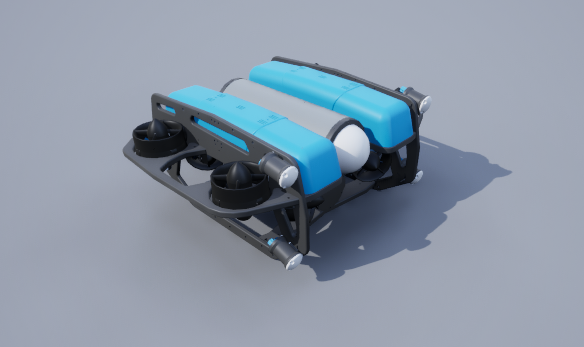
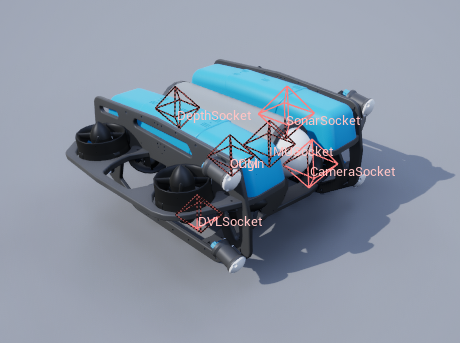
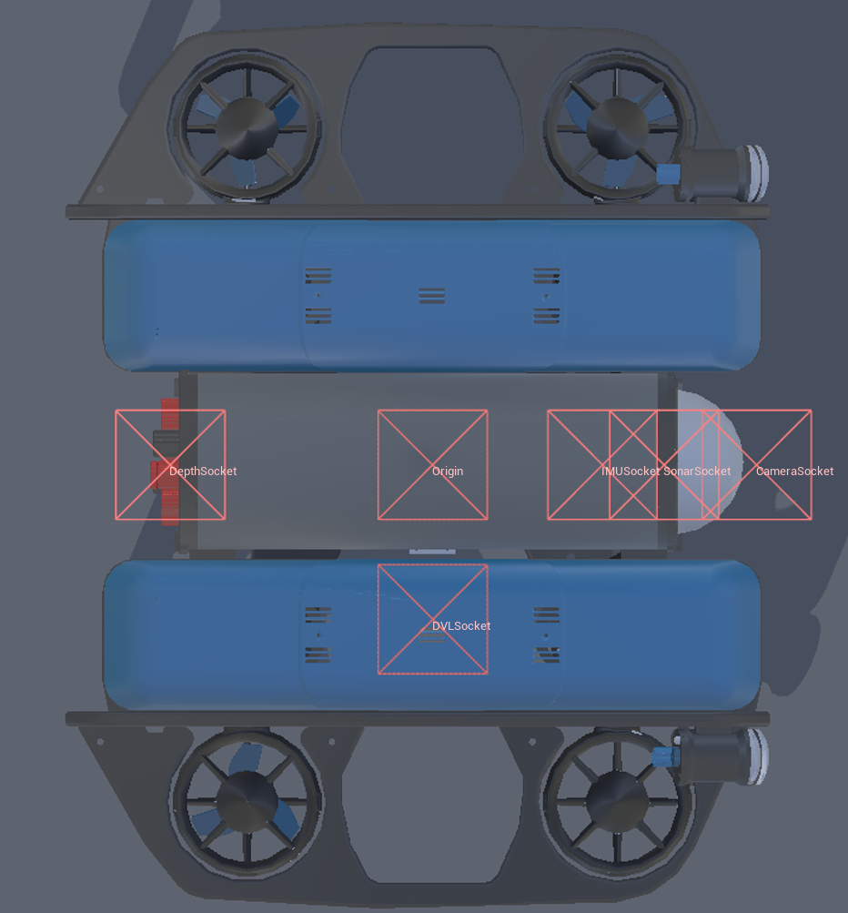
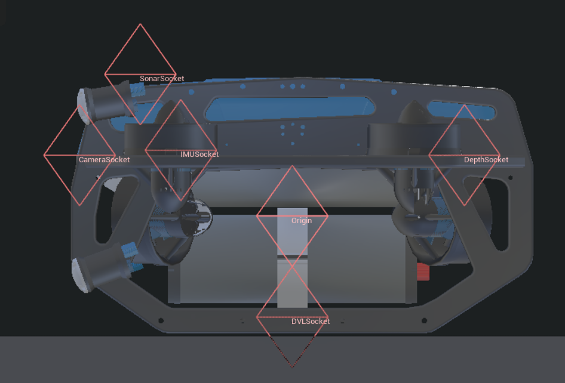
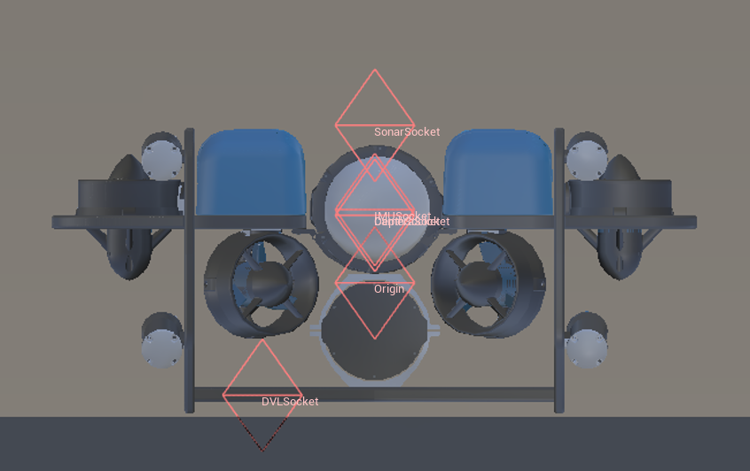

.. _`blue-rov-heavy-agent`:

==============
BlueROV2 Heavy
==============

Description
===========
An implementation of the BlueROV2 Heavy vehicle from Blue Robotics. 

See the :class:`~biguasim.agents.BlueROVHeavy`.

Control Schemes
===============

**cmd_vel**
  Uses internal PID controllers to achieve target linear velocities.

  * **Format**: A 3-length vector ``[vx, vy, vz]``.

  * **Units**: Meters per second (m/s).

**cmd_vel_yaw**
  Maintains target linear velocities while controlling the heading rate.

  * **Format**: A 4-length vector ``[vx, vy, vz, yaw_rate]``.

  * **Units**: m/s for velocity and rad/s for angular rate.

**cmd_pos_yaw**
  A high-level position controller to move the vessel to a specific global coordinate and heading.

  * **Format**: A 4-length vector ``[x, y, z, yaw]``.

**thrusters**
  Provides direct, raw access to the propulsion system.

  * **Format**: A 2-length vector ``[r1 thruster, r2 thruster, r3 thruster, r4 thruster, r5 thruster, r6 thruster, r7 thruster, r8 thruster]``.

**scheme_accel**
  Applies direct linear and angular accelerations to the agent in the global frame.
  
  * **Format**: A 6-length vector ``[lin_acc_x, lin_acc_y, lin_acc_z, ang_acc_x, ang_acc_y, ang_acc_z]``.

Sockets
=======
All sockets have standard orientation unless stated otherwise. Standard orientation has the x-axis 
pointing towards the front of the vehicle, the y-axis pointing starboard, and the z-axis pointing 
upwards. 

Socket Definitions
------------------
- ``COM`` Center of mass.
- ``SonarSocket`` Location of the sonar sensor.
- ``DVLSocket`` Location of the DVL.
- ``IMUSocket`` Location of the IMU. Rotated 180 on x-axis, i.e. in a NED frame instead of NWU.
- ``DepthSocket`` Location of the depth sensor.
- ``CameraSocket`` Location of the camera.
- ``Origin`` True center of the robot.
- ``Viewport`` Where the robot is viewed from.

Socket Frames
-------------

