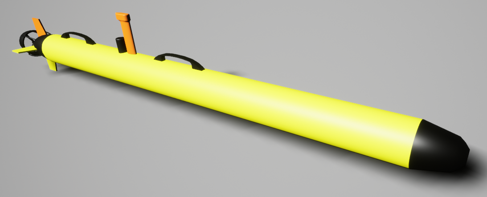
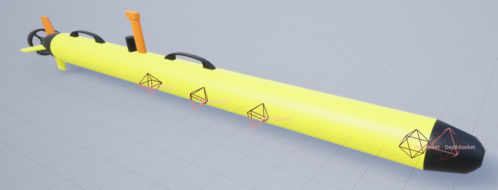
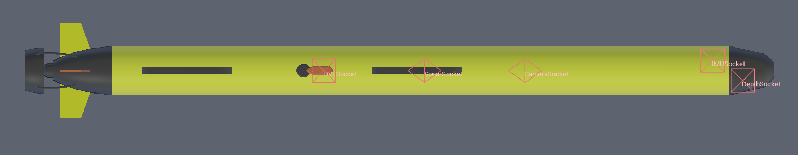
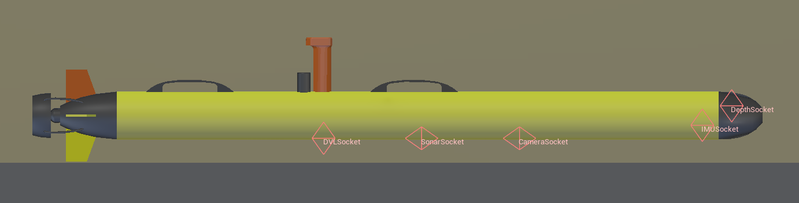

.. _`torpedo-auv-agent`:

==========
TorpedoAUV
==========

Description
===========
A generic torpedo-style AUV with four fins.

See the :class:`~biguasim.agents.TorpedoAUV`.

Control Abstractions
====================

**scheme_rudders_sterns_motor_speed**
  The primary low-level control for the TorpedoAUV actuators.

  **Format**: A 5-length vector ``[rudder_top, rudder_bottom, stern_left, stern_right, rpm]``.

  **Actuators**:
      * ``rudder_top/bottom``: Control the vertical fins for **Yaw** (left/right).
      * ``stern_left/right``: Control the horizontal planes for **Pitch** (up/down).
      * ``rpm``: Controls the main rear propeller thrust.

  **Note**: Since it's a fin-steered vehicle, you must have forward velocity (RPM > 0) for the rudders/sterns to generate lift and turn the agent.

**scheme_depth_heading_rpm_surge**

  An intermediate abstraction that uses internal PIDs to maintain specific navigation states.
  **Format**: A 4-length vector ``[depth, heading, rpm, surge]``.

  **Parameters**:
      * ``depth``: Target depth in meters (negative values).
      * ``heading``: Target yaw orientation in degrees or radians (depending on agent config).
      * ``rpm``: Base motor speed.
      * ``surge``: Desired forward speed component.

**scheme_accel**

  Applies direct linear and angular accelerations to the agent in the global frame.
  
  **Format**: A 6-length vector ``[lin_acc_x, lin_acc_y, lin_acc_z, ang_acc_x, ang_acc_y, ang_acc_z]``.

Sockets
=======
All sockets have standard orientation unless stated otherwise. Standard orientation has the x-axis 
pointing towards the front of the vehicle, the y-axis pointing starboard, and the z-axis pointing 
upwards.

Socket Definitions
------------------
- ``COM`` Center of mass.
- ``CameraSocket`` Location of camera, rotated -90 on y-axis.
- ``DVLSocket`` Location of the DVL
- ``IMUSocket`` Location of the IMU.
- ``DepthSocket`` Location of the depth sensor.
- ``SonarSocket`` Location of the sonar sensor, rotated -90 on y-axis.
- ``Viewport`` where the robot is viewed from.

Socket Frames
-------------

